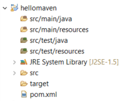

# Back to Basics : Créer un projet Maven sous Eclipse

## Un nouveau projet Maven
Sélectionnez `File -> New -> Project... `. Une boîte de dialogue s'ouvre, sélectionnez `Maven` puis `Maven Project` pour pouvoir créer un nouveau projet [Maven](https://maven.apache.org/).


Cochez `Create a simple project` (skip archetype selection), et laissez choché `Use default Workspace location`.


Cliquez sur `Next` pour renseigner ensuite le `groupId` et l'`artifactId`.

- Le **groupId** est un identifiant unique pour l'organisation qui créé le projet : il est généralement construit à partir du nom de domaine de l’organisation responsable du projet. 
- L'**artifactId** est le nom unique pour l'artefact principal généré par ce projet. Typiquement en Java cet artefact est un fichier jar. L'artifactId apparaîtra comme le nom du projet dans le vue Package Explorer : utilisez uniquement des minuscules pour ce nom de projet (sous peine de lever une issue SonarLint).


Il ne reste plus qu'à cliquer sur `Finish` pour créer le projet Maven et le voir s'afficher dans le **Package Explorer** d'Eclipse.

**[Avril 2018]** : Si vous avez une erreur du genre *Could not resolve archetype...*, supprimez le répertoire `repository` que vous trouverez dans le répertoire `.m2` sous `C:\Users\{user_name}\.m2` et re-essayez de créer un projet maven.  

Vous pouvez désormais ouvrir le nouveau projet maven créé. 

Il est intéressant de noter que tous les projets Maven tendent à avoir la même structure.



Les *source folder* (là où devra être écrit le code) se trouvent en haut de la structure. 
Cette structure sépare clairement le code de production `src/main/...` et le code de test `src/t/test`.
Ainsi, parmi les répertoires standards d'un projet Maven se trouvent :
	
* le *source folder* `src/main/java` où vous déposerez vos fichiers relatifs au **code de production**
* le *source folder* `src/main/resources` où vous déposerez éventuellement les fichiers de resources dont votre code de production pourrait avoir besoin.


* le *source folder* `src/test/java` où vous déposerez vos fichiers relatifs au **code de test**
* le *source folder* `src/main/resources` où vous déposerez éventuellement les fichiers de resources dont votre code de test pourrait avoir besoin.  


Ensuite l'arborescence indique après le `JRE System Library` la version du JDK qui est actuellement utilisée `[JSE-1.5]`. Nous allons très vite et très facilement changer cette version grâce au fichier `pom.xml`.


S'en suit deux simples *folder* :
* `src`: n'y touchez pas et pensez bien à déposer vos codes sources dans les sources folders en haut de la structure et jamais dans ce simple folder !!!
* `target` qui contiendra les binaires `.class` (du code et des tests), les `.jar` générés, les résultats des tests...
* ...


* et surtout un fichier de configuration appelé **`pom.xml`**
	

## Quelques mots sur le POM
Le **P**rojet **O**bject **M**odel (POM) est le fichier central de configuration d'un projet Maven. Il contient une description détaillée du projet, où l'on retrouve des informations concernant le versionnage et la gestion des configurations, les dépendances, les ressources de l’application, les tests, ...

Le `pom.xml` généré par défaut pour un simple projet maven sera le pom le plus simple que nous pouvons trouver.
```XML  
<project xmlns="http://maven.apache.org/POM/4.0.0" xmlns:xsi="http://www.w3.org/2001/XMLSchema-instance" xsi:schemaLocation="http://maven.apache.org/POM/4.0.0 https://maven.apache.org/xsd/maven-4.0.0.xsd">
  <modelVersion>4.0.0</modelVersion>
  <groupId>fr.unilim.iut</groupId>
  <artifactId>hellomaven</artifactId>
  <version>0.0.1-SNAPSHOT</version>
</project>  
```


Nous allons lui apporter quelques modifications pour obtenir le fichier de configuration suivant qui servira de base minimale à nos futurs projets Maven ...


#### La version Java et l'encodage UTF-8
Le bloc défini par la balise`<properties> ... </properties>` permet d'indiquer, entre autres, la version Java et l'encodage que vous souhaitez utiliser de la manière suivante :

```XML  
<properties>
    <project.build.sourceEncoding>UTF-8</project.build.sourceEncoding>
    <maven.compiler.source>1.17</maven.compiler.source>
    <maven.compiler.target>£{maven.${maven.compiler.source}</maven.compiler.target>
 </properties> 
``` 

Ce bloc se place habituellement dans la balise `<project>` et après la balise `</version>`.


#### Les dépendances
Le bloc défini par la balise `<dependencies> ... </dependencies>` contiendra toutes les dépendances de votre projet (librairies/frameworks dont vous avez besoin pour mener à bien votre projet).  

Chaque dépendance doit être paramétrée dans un bloc défini par la balise `<dependency> ... </dependency>`.    

Ici, la dépendance est pour [JUnit5](https://junit.org/junit5/).  

Les frameworks/librairies proposent en général dans leur documentation le bloc `<dependency> ... </dependency>` à intégrer au `pom.xml`, bien souvent dans la section *Download and install* ou *Getting started*.  
Pour Junit 5, ce petit bout de code se trouve dans la section [4.Running Tests -> 4.2 Build Support -> 4.2.2 Maven](https://junit.org/junit5/docs/current/user-guide/#running-tests-build-maven), mais nous ne le copierons pas tout de suite et allons voir une autre méthode pour écrire et comprendre ce code pas à pas...


C'est le site [mvnrepository.com](https://mvnrepository.com/) qui va nous aider car ce site regroupe toutes les dépendances de maven. Pour chercher JUnit 5, tapez `junit-jupiter` (voir le cours sur les tests unitaires).


Cliquez sur `JUnit Jupiter (Aggregator)`, puis cliquez sur la dernière **Version** stable, le dernier chiffre en haut du tableau et recopiez le bloc dependency qui vous ait donné de manière à maodifier votre `pom` de la manière suivante :

```XML  
<dependencies>
	<dependency>
    	<groupId>org.junit.jupiter</groupId>
    	<artifactId>junit-jupiter</artifactId>
    	<version>5.8.2</version>
    	<scope>test</scope>
	</dependency>
</dependencies>  
```

Ce bloc se place habituellement dans la balise `<project>` et après la balise `</properties>`.

L'attribut `<version>...</version>` permet rapidement de changer de version : rendez-vous sur la première page du site  [JUnit5](https://junit.org/junit5/) pour en connaître la dernière version dans la rubrique **Latest Release**.


#### Les plug-ins
Dans la dépendance précédente, il y a une balise `<scope>test</scope>`.
Si vous laissez cette balise, il faut mettre à jour le plug-in `maven-surefire` qui est le **plugin de test pour maven**.

L'ajout d'un plug-in se fait dans une balise <plug-in> incluse dans une balise <plugins> (pouvant contenir plusieurs plug-ins, le tout dans une balise <build>.  
Revenez dans la documentation Junit [4.Running Tests -> 4.2 Build Support -> 4.2.2 Maven](https://junit.org/junit5/docs/current/user-guide/#running-tests-build-maven) pour voir comment insérer le plug-in maven-surefire :

```XML  
	<build>
		<plugins>
			<plugin>
				<artifactId>maven-surefire-plugin</artifactId>
				<version>2.22.2</version>
			</plugin>
		</plugins>
	</build>  
```


Tapez `maven-surefire` dans [mvnrepository.com](https://mvnrepository.com/) pour choisir `Maven Surefire Plugin` et récupérez le code XML de la balise <dependency> de la dernière version stable de ce plug-in...


#### Mettre à jour le `pom.xml`

Si vous avez suivi pas à pas toutes ces étapes, votre `pom.xml` devrait maintenant ressembler à (aux quelques commentaires près :

```XML
<project xmlns="http://maven.apache.org/POM/4.0.0" xmlns:xsi="http://www.w3.org/2001/XMLSchema-instance" xsi:schemaLocation="http://maven.apache.org/POM/4.0.0 https://maven.apache.org/xsd/maven-4.0.0.xsd">
	<modelVersion>4.0.0</modelVersion>
	<groupId>fr.unilim.iut</groupId>
	<artifactId>hellomaven</artifactId>
	<version>0.0.1-SNAPSHOT</version>

	<!-- Indiquer l'encodage et la version du JDK à utiliser -->
	<properties>
		<project.build.sourceEncoding>UTF-8</project.build.sourceEncoding>
		<maven.compiler.source>1.17</maven.compiler.source>
		<maven.compiler.target>1.17</maven.compiler.target>
	</properties>

	<dependencies>
		<!-- Dépendance vers JUnit 5 -->
		<dependency>
			<groupId>org.junit.jupiter</groupId>
			<artifactId>junit-jupiter</artifactId>
			<version>5.8.2</version>
			<scope>test</scope>
		</dependency>
	</dependencies>

	<build>
		<plugins>
			<!-- Pour être compatible avec JUnit 5 -->
			<plugin>
				<artifactId>maven-surefire-plugin</artifactId>
				<version>2.22.2</version>
			</plugin>
		</plugins>
	</build>
</project>
```


Une fois, le `pom.xml` modifié, reformatez-le avec le raccourci `Maj+CTRL+F` et sauvegardez-le.

Pour que ces modifications soient bien prises en compte sur votre projet, il faut effectuer une mise à jour du `pom.xml` de la manière suivante :  
Effectuez un clic droit sur le nom du projet (`hellomaven`), afin de pouvoir lancer `Maven -> Update Project... ` et cliquez que `OK` pour valider.

La mise à jour s'effectue et la première fois peut être un peu longue...  

Astuce : Pour savoir si la mise à jour s'est effectuée correctement, vérifiez que la version du JDK que vous avez paramètré dans le `pom.xml` s'affiche désormais dans votre vue Package Explorer sur la ligne `JRE System Library`.

A l'avenir, ne pas oublier d'Updater à chaque fois que vous modifierez votre POM !


## Quelques liens utiles pour en savoir plus ...
[Site officiel de Maven : maven.apache.org](https://maven.apache.org/)      
[Site mvnrepository.com](https://mvnrepository.com/) 
[Quelques mots de Maven sur Wikipedia](https://fr.wikipedia.org/wiki/Apache_Maven)    
Un autre tutoriel sur l'[initiation à Maven à destination des étudiants d'IUT](https://github.com/nedseb/TutoMaven)    
Livre Apache-Maven de Nicolas De loof et Arnaud Héritier (français) disponible en ligne [ici](https://ndeloof.github.io/apache-maven-book/) (avec les sources [là](https://github.com/ndeloof/apache-maven-book)) 

## Remarque
Il est possible de transformer un simple projet java en projet maven à l'aide de `Configure -> Convert to Maven Project`, sans oublier un `Update Project`, une fois le projet mavenisé...


