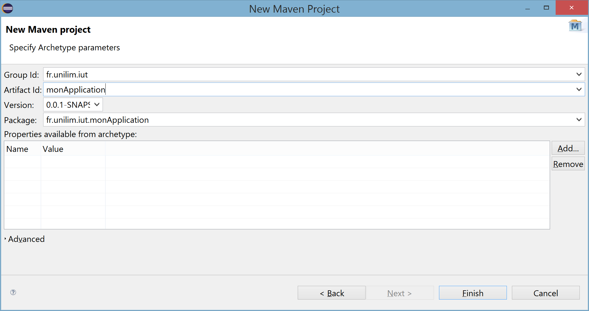

# Back to Basics : Créer un projet Maven sous Eclipse

## Un nouveau projet Maven
Sélectionnez `File -> New -> Project... `. Une boîte de dialogue s'ouvre, sélectionnez `Maven` puis `Maven Project` pour pouvoir créer un nouveau projet [Maven](https://maven.apache.org/).


Cliquez sur `Next` pour sélectionner l'endroit où vous souhaitez enregistrer votre projet.
 
Cliquez sur `Next` pour sélectionner l'archétype que vous souhaitez utiliser.   
Par défaut `maven-archetype-quickstart` est sélectionné et nous garderons cet archétype pour créer notre premier projet Maven.

Cliquez sur `Next` pour renseigner ensuite le `groupId` et l'`artifactId`.

- Le **groupId** est un identifiant unique pour l’organisation qui créé le projet : il est généralement construit à partir du nom de domaine de l’organisation responsable du projet. 
- L'**artifactId** est le nom unique pour l’artefact principal généré par ce projet. Typiquement en Java cet artefact est un fichier jar. 



Il ne reste plus qu'à cliquer sur `Finish` pour créer le projet Maven et le voir s'afficher dans le **Package Explorer** d'Eclipse.

Vous pouvez désormais ouvrir le nouveau projet maven créé. 

Il est intéressant de noter que tous les projets Maven tendent à avoir la même structure.


Parmi les répertoires standard d'un projet Maven, on retrouve, entre autres :
	
* `src/main/java` où vous devez déposer vos fichiers relatifs au code source java de production
* `src/test/java` où vous devez déposer vos fichiers relatifs code source java de test
* `target` qui contiendra les fichiers résultat, les binaires (du code et des tests), les jar générés et les résultats des tests.
* ...
* et surtout un fichier de configuration appelé **`pom.xml`**
	

## Quelques mots sur le POM
Le **P**rojet **O**bject **M**odel (POM) est le fichier central de configuration d'un projet Maven. Il contient une description détaillée du projet, où l'on retrouve des informations concernant le versionnage et la gestion des configurations, les dépendances, les ressources de l’application, les tests, ...

Un `pom.xml` généré par défaut. Nous allons lui apporter quelques modifications pour obtenir le fichier de configuration suivant qui servira de base minimale à nos futurs projets Maven ...

```XML
<project xmlns="http://maven.apache.org/POM/4.0.0" xmlns:xsi="http://www.w3.org/2001/XMLSchema-instance"
  xsi:schemaLocation="http://maven.apache.org/POM/4.0.0 http://maven.apache.org/xsd/maven-4.0.0.xsd">
  <modelVersion>4.0.0</modelVersion>

  <groupId>fr.unilim.iut</groupId>
  <artifactId>monApplication</artifactId>
  <version>0.0.1-SNAPSHOT</version>
  <packaging>jar</packaging>

  <name>monApplication</name>
  <url>http://maven.apache.org</url>

 <properties>
    <project.build.sourceEncoding>UTF-8</project.build.sourceEncoding>
    <maven.compiler.source>1.8</maven.compiler.source>
    <maven.compiler.target>1.8</maven.compiler.target>
  </properties>

  <dependencies>
    <dependency>
      <groupId>junit</groupId>
      <artifactId>junit</artifactId>
      <version>4.12</version>
      <scope>test</scope>
    </dependency>
  </dependencies>
</project>
```
Regardons ce qui peut changer par rapport votre l'actuel fichier `pom.xml` de votre projet :

#### La version Java
Le bloc `<properties> ... </properties>` permet d'indiquer, entre autres, la version Java que vous souhaitez utiliser.

#### Les dépendances
Le bloc `<dependencies> ... </dependencies>` contiendra toutes les dépendances de votre projet (librairies/frameworks dont vous avez besoin pour mener à bien votre projet).  

Chaque dépendance doit être paramétrée dans un bloc `<dependency> ... </dependency>`.    

Ici, la dépendance est pour [JUnit](http://junit.org/junit4/).  
Les frameworks/librairies proposent en général leur documentation le bloc `<dependency> ... </dependency>` à intégrer au `pom.xml`, bien souvent dans la section [Download and install](https://github.com/junit-team/junit4/wiki/Download-and-Install), comme c'est le cas pour JUnit.  

L'attribut `<version>...</version>` permet rapidement de changer de version (rendez-vous sur le site de [JUnit](http://junit.org/junit4/) pour en connaître la dernière version)

#### Mettre à jour le `pom.xml`

Mettez à jour le `pom.xml` de votre projet à partir du fichier `pom.xml` précédent, de manière à développer avec la version 1.8 de Java (`<properties>`) et d'utiliser la dernière version de JUnit(`<dependencies>`).  

Une fois, le `pom.xml` modifié, sauvegardez-le.

Pour que ces modifications soient bien prises en compte sur votre projet, il faut effectuer une mise à jour du `pom.xml` de la manière suivante :  
Effectuez un clic droit sur le nom du projet (`monApplication`), afin de pouvoir lancer `Maven -> Update Project... `, vérifier que `Force Update of Snapshots/Releases` est bien coché et cliquez que `OK` pour valider.

La mise à jour s'effectue.

A l'avenir, ne pas oublier d'Updater chaque fois que vous modifierez votre POM !


## Quelques liens utiles pour en savoir plus ...
[Site officiel de Maven : maven.apache.org](https://maven.apache.org/)    
[Quelques mots de Maven sur Wikipedia](https://fr.wikipedia.org/wiki/Apache_Maven)    
Tutoriel plus détaillé sur l'[initiation à Maven à destination des étudiants d'IUT](https://github.com/nedseb/TutoMaven)  

## Remarque
Il est possible de transformer un simple projet java en projet maven à l'aide de `Configure -> Convert to Maven Project`, sans oublier un `Update Project`, une fois le projet mavenisé...


